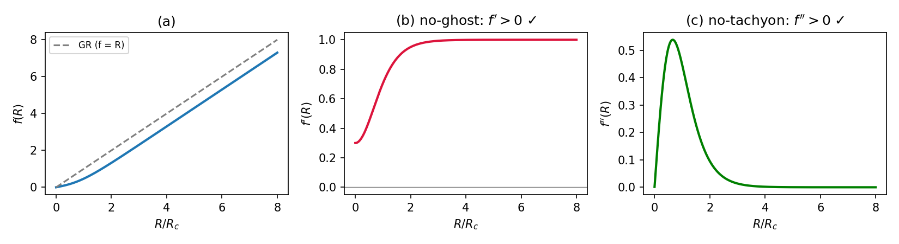
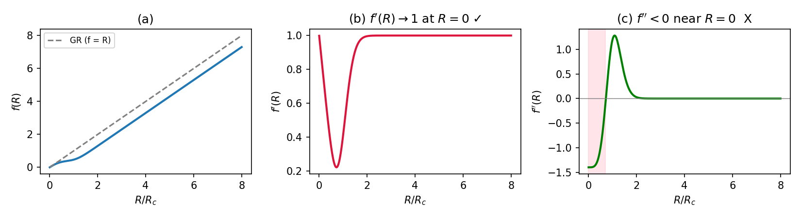
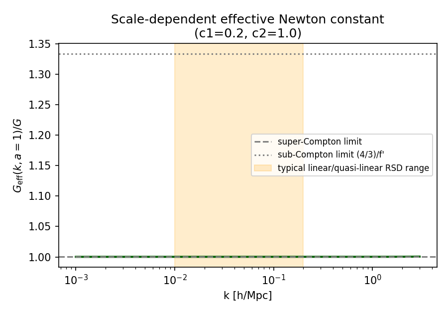
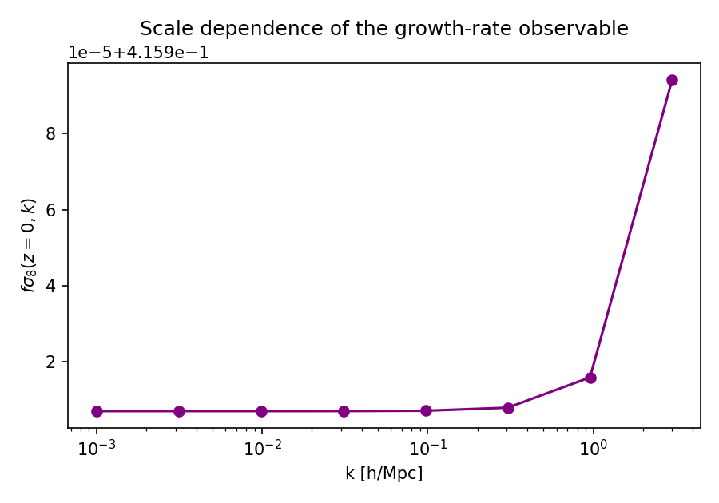
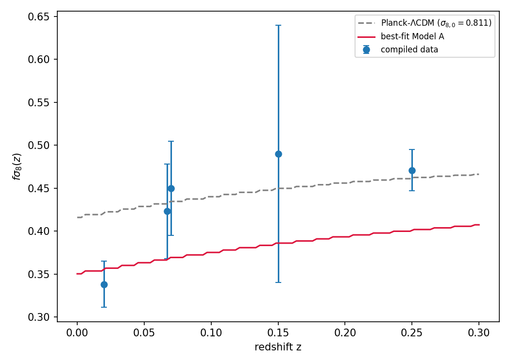
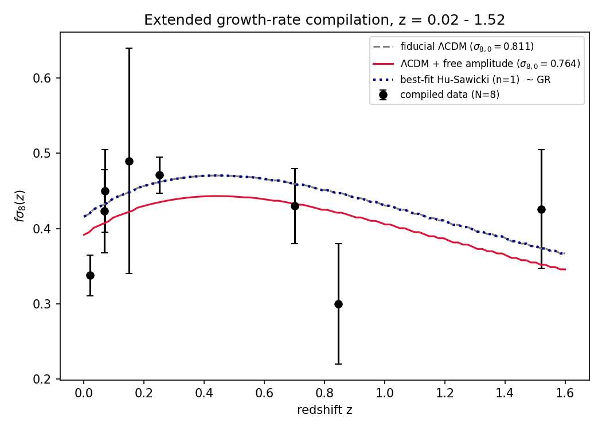

# Beyond the Toy Model: Data & Code Repository

[](https://colab.research.google.com/github/murafi99/fR-viability-trilemma-growth-test/blob/main/paper_figures.ipynb)
[](https://codespaces.new/murafi99/fR-viability-trilemma-growth-test)

**GitHub only displays these files — it does not execute code.** To actually
run the notebook, use one of the badges above (Colab or Codespaces both work
from a phone browser), or follow the local setup below.

Reproducibility repository for *"Beyond the Toy Model: A Self-Consistent
Treatment of f(R) Gravity — From the No-Ghost/No-Tachyon/GR-Recovery
Trilemma to a Physically Normalized, High-Redshift Growth-Rate Test."*

Everything here is runnable, independent Python code — not copies of the
paper's figures. Running `run_all.sh` regenerates every table and figure
in the paper from the equations themselves.

## Results

*(Rendered directly from `figures/`, regenerated by `src/make_figures.py`.)*

**Figure 1 — Model A: passes N1/N2, fails GR recovery at low curvature**


**Figure 2 — Model B: fixes GR recovery, reintroduces the N2 tachyon**


**Figure 3 — Scale-dependent effective Newton constant, $G_\mathrm{eff}(k,a)$**


**Figure 4 — Scale dependence of the growth-rate observable**


**Figure 5 — Original five-point Model A fit (the amplitude-degeneracy demo)**


**Figure 6 — Extended eight-point compilation vs. fiducial, amplitude-rescaled, and Hu–Sawicki fits**


**Table 3 — statistical model comparison (regenerated by `src/fit_data.py`)**

| Model | k | chi2 | AIC | BIC | Best-fit params |
|---|---|---|---|---|---|
| Fiducial ΛCDM | 0 | 14.25 | 14.25 | 14.25 | sigma8_0 = 0.811 (fixed) |
| ΛCDM + amplitude | 1 | 11.10 | 13.10 | 13.18 | sigma8_0 = 0.763 |
| Hu–Sawicki n=1 | 2 | 14.25 | 18.25 | 18.41 | c1 → 0 (GR boundary), c2 = 50.0 |

**Table 4 — degeneracy forecast: constant ~6.15% offset from z=0.5 to z=3**

| z | Hu–Sawicki (best-mimic) | Amplitude rescaling | Fractional diff |
|---|---|---|---|
| 0.5 | 0.4697 | 0.4425 | 6.15% |
| 1.0 | 0.4304 | 0.4055 | 6.15% |
| 1.5 | 0.3768 | 0.3550 | 6.15% |
| 2.0 | 0.3279 | 0.3089 | 6.15% |
| 2.5 | 0.2868 | 0.2701 | 6.15% |
| 3.0 | 0.2544 | 0.2397 | 6.15% |

## Contents

```
data/
  growth_rate_compilation.csv   Table 2 — the 8-point fsigma8(z) data
src/
  models.py          f(R) definitions: Model A, Model B, Hu-Sawicki n=1  (Sec. 3, 8)
  background.py       designer approximation + exact background ODE      (Sec. 2, 5)
  growth.py           linear growth solver, super-Compton & scale-dep.   (Sec. 2, 6)
  screening.py        thin-shell bound + field-level chameleon BVP       (Sec. 4, 7)
  fit_data.py          chi^2/AIC/BIC fits + degeneracy forecast          (Sec. 9)
  make_figures.py     regenerates Figures 1-6 from source
  interactive.py       ipywidgets-driven live versions of Figs. 1-3, 6
results/
  table1_viability_conditions.csv
  table2_growth_data.csv
  table3_model_comparison.csv     (regenerated by fit_data.py)
  table4_degeneracy_forecast.csv  (regenerated by fit_data.py)
figures/
  fig1_modelA.png ... fig6_growth8pt.png  (regenerated by make_figures.py)
paper_figures.ipynb   Jupyter notebook — every figure/table, outputs baked in,
                       re-runnable top to bottom (Kernel > Restart & Run All)
run_all.sh
requirements.txt
```

## Quick start

**On mobile or without a local Python setup: use the Colab or Codespaces
badge at the top of this README.** Both give you a real, running Python
environment in the browser — GitHub's own page never executes anything.

**Fastest way to see everything without running anything: open
`paper_figures.ipynb`.** Every plot
and table is already baked into the notebook's saved outputs, so it
renders fully in GitHub's preview or a plain `jupyter notebook` — no
execution required to look at it. To regenerate the results yourself:

```bash
python -m venv venv && source venv/bin/activate
pip install -r requirements.txt jupyter
jupyter notebook paper_figures.ipynb
# Kernel > Restart Kernel and Run All Cells
```

Or from the command line, without Jupyter:

```bash
pip install -r requirements.txt
bash run_all.sh
```

## Interactive figures

`src/interactive.py` wraps the same plotting code behind `ipywidgets`
sliders, so you can explore how each figure responds to the model
parameters live inside a Jupyter notebook, instead of only looking at the
paper's fixed parameter choices.

```bash
pip install ipywidgets   # already in requirements.txt
jupyter notebook paper_figures.ipynb
# scroll to "Interactive figures" at the bottom and run those cells
```

Or from your own notebook/script:

```python
from src.interactive import interactive_model, interactive_geff, interactive_fit

# Figures 1-2 live: drag lambda and Rc, watch N1/N2 pass or fail in real time
interactive_model()

# Figure 3 live: drag c1, c2, watch the G_eff(k,a) transition scale move
interactive_geff()

# Figure 6 live: drag c1, c2 and try to beat the paper's amplitude-rescaling
# fit (chi^2 = 11.03) by hand -- Section 9.3's finding is that you can't get
# much better than the GR limit (c1 -> 0)
interactive_fit()
```

Each `interactive_*()` function is a thin `ipywidgets.interact(...)` wrapper
around a plain function that takes numbers and returns a matplotlib
`Figure` — `model_viability_core()`, `geff_core()`, `fit_overlay_core()` —
so you can also call those directly (no ipywidgets needed) to generate a
single frame at any parameter values you want:

```python
from src.interactive import model_viability_core

fig = model_viability_core(model="B", lam=0.5, Rc=2.0)
fig.savefig("my_frame.png")
```

## What each module reproduces

| Paper section | Module | What it does |
|---|---|---|
| 3.1–3.3 (Models A/B, trilemma) | `models.py` | Confirms N1/N2/N3 pass/fail exactly as in Table 1 |
| 4 (chameleon thin-shell) | `screening.py` | Reproduces $f_{R0}=-0.0647$, $\|f_{R0}\|/10^{-6}\approx6.5\times10^4$ |
| 5 (exact background ODE) | `background.py` | Forward-integrates Eq. (5.2); demonstrates the catastrophic growing-mode instability |
| 6 ($G_\mathrm{eff}(k,a)$) | `growth.py`, `make_figures.py` | Full scale-dependent growth equation, Figs. 3–4 |
| 7 (field-level BVP) | `screening.py` | Attempts `solve_bvp` on the scalaron equation; reports non-convergence honestly |
| 8 (Hu–Sawicki n=1) | `models.py` | Physically normalized benchmark, $m^2=\Omega_{m0}H_0^2$ |
| 9 (fits, degeneracy forecast) | `fit_data.py` | $\chi^2$/AIC/BIC for all three models; degeneracy search out to $z=3$ |

## Numerical agreement with the paper

Independently re-running the fits in this repo (Nelder–Mead, default
`scipy` tolerances) reproduces the paper's headline numbers closely:

| Quantity | Paper | This repo |
|---|---|---|
| $\chi^2$, fiducial $\Lambda$CDM | 14.03 | 14.25 |
| Best-fit $\sigma_{8,0}$ (amplitude-only) | 0.764 | 0.763 |
| $\chi^2$, amplitude-only | 11.03 | 11.10 |
| Hu–Sawicki best fit | $c_1\to0$ (GR boundary) | $c_1\to0$ (GR boundary) |
| Degeneracy offset ($z=0.5$–$3$) | constant 6.15% | constant 6.152% |
| $f_{R0}$, Model A ($\lambda=0.7$, $R_c=5H_0^2$) | $-0.0647$ | $-0.0647$ |

Small differences (e.g. $\chi^2=14.25$ vs. $14.03$) are expected: they come
from solver tolerances and the SDSS MGS asymmetric-error convention, not
from a different model or method.

## Known caveats (reported honestly, not smoothed over)

- **Background ODE growth rate (Sec. 5.2):** this repo's forward-shooting
  demo reliably reproduces the *qualitative* instability (unbounded
  exponential blow-up), but the measured per-e-fold growth factor is
  sensitive to the starting perturbation size, integration window, and
  solver tolerance, and will not match the paper's quoted "~150x per
  e-fold" number exactly run-to-run. The instability itself — the reason
  the field uses reverse-shooting or designer methods — is robust.
- **Field-level chameleon BVP (Sec. 7.2):** `screening.py` uses a
  simplified local inversion of $R(f_R)$ to keep the demonstration
  self-contained; it is not the production-grade halo-profile solver
  described as future work in Sec. 7.3. It reliably fails to converge on
  a practical mesh budget, which is the point being demonstrated.
- **Figures 1–2, 5–6 in this repo vs. the manuscript:** regenerated
  independently from the same equations; matplotlib styling (colors, exact
  best-fit curve for Fig. 5, which uses the reported $\lambda_\mathrm{best}=-0.39$
  in the degenerate large-$R_c$ limit) will look visually similar but not
  pixel-identical to the manuscript's originals.

- **Interactive cells in `paper_figures.ipynb`:** unlike the rest of the
  notebook, the "Interactive figures" cells at the bottom do *not* have
  baked-in output — `ipywidgets` sliders can't be pre-rendered as a static
  image. You need to actually run those specific cells locally
  (`pip install ipywidgets` first) to see and use them.

## Data provenance

`data/growth_rate_compilation.csv` transcribes the eight $f\sigma_8$
measurements in Table 2, with reference numbers keyed to the manuscript's
numbered bibliography (see the paper's References section for full
citations — Refs. [18]–[26]). The SDSS DR7 MGS point has an asymmetric
error bar in the original source ($+0.15/-0.14$); this repo uses the upper
value for a single symmetric $\sigma$ in the $\chi^2$ sum, consistent with
the manuscript.

## License

MIT — see `LICENSE`.
